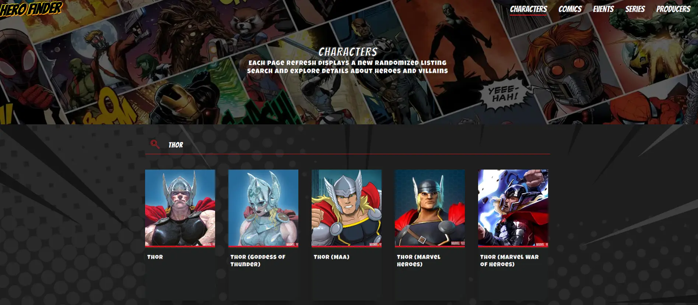
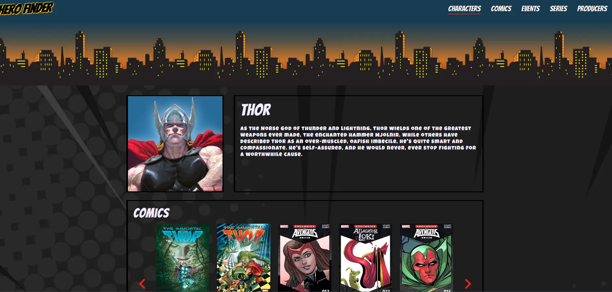

# :superhero: Hero Finder - Explore, Discover, Dive Deep :supervillain_woman:

The project is an interactive platform that allows Marvel fans to explore and discover detailed information about their favorite characters, events, series, producers, and comics. Users can individually explore each item and uncover their connections with other elements. With an intuitive and informative interface, it offers an engaging and convenient experience to learn more about the vast Marvel universe.

The data is provided through an API in which marvel makes available -
[Marvel Api](https://developer.marvel.com/), except the home page.

**Marvel provides 3000** free data requests per day. If this limit is exceeded, an error will be displayed on the screen, and unfortunately, you will have to wait a day to access the data again.

Project developed as the main focus of improving my knowledge

Take a look at the project. I would be happy if you could share your feedback and experience. [Click here](https://herofiinder.netlify.app?utm_source=gitHub&utm_campaign=social=utm_campaign=project_heroFinder) .

## :technologist: Technologies

- [React](https://reactjs.org/)
- [Styled-components](https://styled-components.com/)
- [react-router-dom](https://www.npmjs.com/package/react-router-dom/)
- [SplideJs](https://splidejs.com/integration/react-splide/)
- JavaScript
- CSS

## About

As a fan of the Marvel universe, I found a way to combine my interest in frontend development with my admiration for the world of heroes.

The project consists of searching for characters, comic books, events, series, and creators. It allows users to delve into specific details about each of them and explore the connections between them.

In the characters, comics, series and products sections, each time the page is loaded, a list will be displayed in random order

### Listing and search page



### Information page



# Usage

**Prerequisites:** Head over to [developer Marvel](developer.marvel.com) and sign up/in to get your API keys. Install the module using yarn or npm and initialize an API client using the public and private API keys for your account.

It will be necessary to generate a hash with the Marvel API keys to make the calls. There is an explanation in the Marvel Portal documentation. Suggested website that generates MD5 hash:

https://www.md5hashgenerator.com/

After creating your marvel account and having your keys, you need to create a .env file in root with the variables below. You can use .env.example from the project

```javascript
REACT_APP_TIMESTAMP = randomTimeStamp;
REACT_APP_API_KEY = yourAPIPublicKey;
REACT_APP_HASH = yourHash;
```

## Setup

1. Clone the repository
2. Install [yarn](https://classic.yarnpkg.com/en/docs/install)
3. Update .env file with your keys
4. run in terminal yarn
5. run in terminal yarn start

## Contact

Take a look at my [portfolio](https://rafaelgomes.netlify.app/utm_source=gitHub&utm_campaign=social=utm_campaign=project_heroFinder).

<a href="https://www.facebook.com/rafael.gomes.961pl/"></a>
<a href="https://www.linkedin.com/in/rafael-gomes-77ab23160/"></a>

:copyright: Developed with 💜 by **[Rafael Gomes](https://www.linkedin.com/in/rafael-gomes-77ab23160/)**
